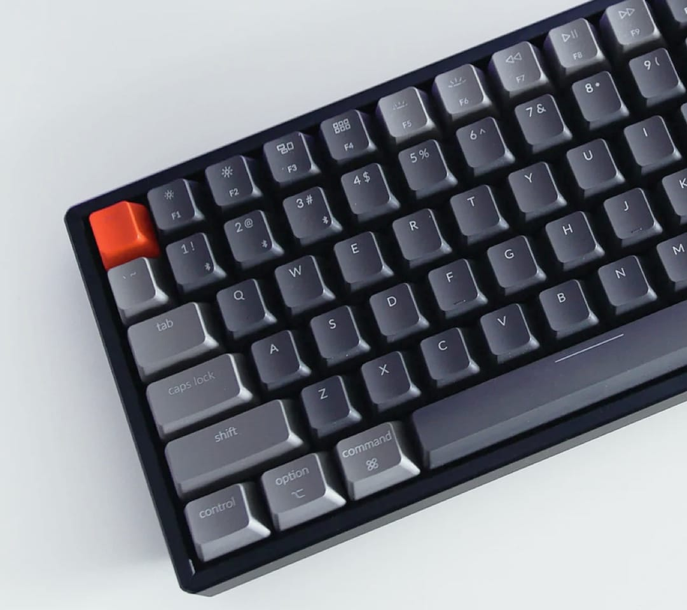

# Frontend Mentor - Typemaster Pre-launch Landing Page

This is a solution to the [Typemaster pre-launch landing page challenge](https://www.frontendmentor.io/challenges/typemaster-prelaunch-landing-page-J6-Yj5J-X) on Frontend Mentor.

## Table of contents

- [Overview](#overview)
  - [The challenge](#the-challenge)
  - [Screenshot](#screenshot)
  - [Links](#links)
- [My process](#my-process)
  - [Built with](#built-with)
  - [What I learned](#what-i-learned)
  - [Continued development](#continued-development)
  - [AI Collaboration](#ai-collaboration)
- [Author](#author)

---

## Overview

### The challenge

Users should be able to:

- View the optimal layout depending on their device's screen size
- See hover states for all interactive elements on the page

### Screenshot


### Links

- Solution URL: [https://github.com/Ismail-SWE/typemaster-project](https://github.com/Ismail-SWE/typemaster-project)
- Live Site URL: *(add your live site URL here)*

---

## My process

### Built with

- Semantic HTML5 markup
- CSS Grid
- Flexbox
- Mobile-first responsive design
- Google Fonts (Barlow + Barlow Condensed)
- CSS custom properties

---

### What I learned

**1. CSS Grid — responsive layout**

```css
.hero {
  display: grid;
  grid-template-columns: 445px 540px;
  align-items: center;
  gap: 125px;
}
```

**2. `::before` pseudo-element — dekorativ fon**

Rasm orqasidagi kulrang fon bo'lagini alohida div qo'shmasdan pseudo-element bilan qildim:

```css
.hero__img-col::before {
  content: '';
  position: absolute;
  left: 12%;
  right: -9999px;
  background: var(--gray-bg);
  border-radius: 2rem 0 0 2rem;
}
```

**3. CSS variables — design system**

```css
:root {
  --orange-500: #F16718;
  --orange-300: #FF9B62;
  --navy:       #162542;
  --gray-mid:   #7B8BAD;
  --gray-bg:    #E8EFF2;
}
```

**4. `<picture>` tegi — responsive rasmlar**

```html
<picture>
  <source media="(max-width: 599px)"  srcset="./assets/mobile/image-keyboard.jpg">
  <source media="(max-width: 1023px)" srcset="./assets/tablet/image-keyboard.jpg">
  
</picture>
```

**5. `object-fit: cover` — rasmni to'g'ri ko'rsatish**

```css
.photo-tall img,
.photo-wide img {
  width: 100%;
  height: 100%;
  object-fit: cover;
}
```

**6. Responsive design — 3 breakpoint**

```css
/* Tablet */
@media (max-width: 1023px) {
  .hero { grid-template-columns: 1fr 1fr; }
  .features { grid-template-columns: 1fr 1fr; }
}

/* Mobile */
@media (max-width: 599px) {
  .hero { grid-template-columns: 1fr; }
  .features { grid-template-columns: 1fr; }
}
```

**7. Figma design system dan CSS ga o'tkazish**

Figma da berilgan spacing, color va typography qiymatlarini CSS variables ga o'tkazish loyihani ancha tartibli qildi.

---

### Continued development

- CSS animations va transitions
- JavaScript interaktivlik
- React framework
- TypeScript
- Accessibility (ARIA) yaxshilash

---

### AI Collaboration

- **Tool:** Claude (Anthropic)
- **How:** Figma dizaynini tahlil qilish, CSS Grid layout tuzish, responsive media query yozish va pseudo-element texnikalarini o'rganishda yordam olindi
- **What worked well:** Figma screenshot larini yuborib, har bir elementning o'lchamini aniqlash va CSS ni bosqichma-bosqich yozish juda samarali bo'ldi
- **What didn't:** Ba'zi vizual natijalar uchun manual trial and error kerak bo'ldi — AI har doim aniq vizual natijani ayta olmaydi

---

## Author

- Frontend Mentor - [@Ismail-SWE](https://www.frontendmentor.io/profile/Ismail-SWE)
- GitHub - [@Ismail-SWE](https://github.com/Ismail-SWE)